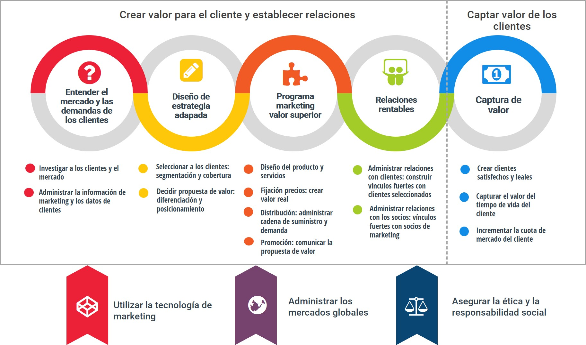
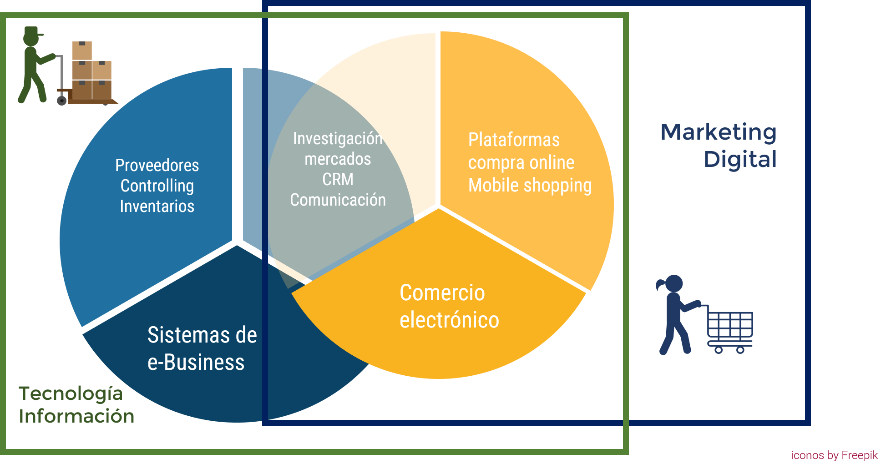

---

class: center, middle, remark-inverse

# 1. Introducción 

---
# Caso de Apertura: Caso Amazon

.pull-left[


<iframe width="340" height="200" src="https://www.youtube-nocookie.com/embed/Cn62Fzd01og?start=10" frameborder="0" allow="encrypted-media"></iframe>

<a href="https://www.youtube-nocookie.com/watch=Cn62Fzd01og?start=10" target="_blank" ><span style="font-size:0.6em">El caso Amazon</span></a> 
]


.pull-right[
- ¿Cuál es la clave de su éxito ?
- ¿En qué se diferencia de un negocio tradicional?
- ¿Quién ha comprado en Amazon?¿Qué era?¿Por qué?
- ¿Qué otros negocios tiene la empresa?
]
---
class: middle, center

# ¿utilizamos el e-commerce?

[Socrative. Room 282228. ADE_SI_T5_1](https://b.socrative.com)
---
# Algunas Cifras

### - **46,9%** personas 16-74 compra Internet últimos 3 meses [(INE)](http://www.ine.es/dyngs/INEbase/es/operacion.htm?c=Estadistica_C&cid=1254736176741&menu=ultiDatos&idp=1254735576692)    

### - **90%** utiliza el móvil en el proceso de compra [(Ditrendia)](http://www.amic.media/media/files/file_352_1050.pdf)

### - **60%** ha utilizado el móvil para comprar mientras estaba en la tienda [(Ditrendia)](http://www.amic.media/media/files/file_352_1050.pdf), el 31% compara precios estando en la tienda [(PWC)](https://www.pwc.com/gx/en/industries/consumer-markets/consumer-insights-survey.html)

### - EL **80%** de las empresas europeas venden online en su propia web o en plataformas de terceros [(Eurobarómetro)](https://ec.europa.eu/commfrontoffice/publicopinion/flash/fl_413_en.pdf)


---
# Comercio electrónico vs Comercio tradicional


.pull-left[
## ¿Son fundamentalmente distintos?

```{r echo=FALSE, message=FALSE, warning=FALSE, out.width="95%"}


```

]


.pull-right[
### - Relaciones directas, fronteras empresas/cliente desdibujadas

### - Plataformas o ecosistemas

### - Foco en los datos

### - Desafíos éticos

### - Tecnología digital como producto
]

---
# ¿Qué entendemos por e-commerce?

> ### <i class="fa fa-quote-left"></i>... Transacciones comerciales posibilitadas digitalmente entre organizaciones y personas o entre organizaciones.

- Transacciones comerciales: intercambios de marketing
- Posibilitadas digitalmente: no únicamente compras online

### Comercio electrónico implica el uso de Internet, la web, aplicaciones o navegadores móviles en las transacciones comerciales

---
# Negocio electrónico es 

> ### <i class="fa fa-quote-left"></i>... conjunto de actividades empresariales basadas en información digital que soportan los intercambios de mercado

- Sistemas de información internos: gestión de la información de negocio

.center[

```{r echo=FALSE, message=FALSE, warning=FALSE, out.width="45%"}

knitr::include_graphics("images/sitecno.jpg")
```
]

---
# Marketing Digital o e-marketing 

> ### <i class="fa fa-quote-left"></i>... uso de medios digitales, tecnología y plataformas digitales para alcanzar e interactuar con consumidores y empresas


- Comercio electrónico: actividades directamente relacionadas con las transacciones
- Marketing digital: comercio electrónico y otras actividades en el proceso de marketing


.center[
```{r echo=FALSE, message=FALSE, warning=FALSE, out.width="45%"}


```
]

---
# Resumen

.center[
```{r echo=FALSE, message=FALSE, warning=FALSE, out.width="95%"}


```
]
                       