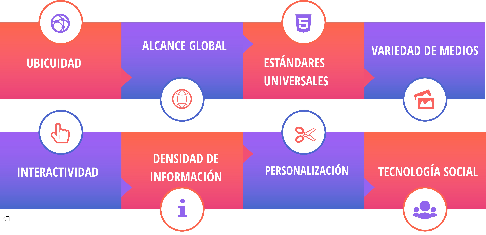
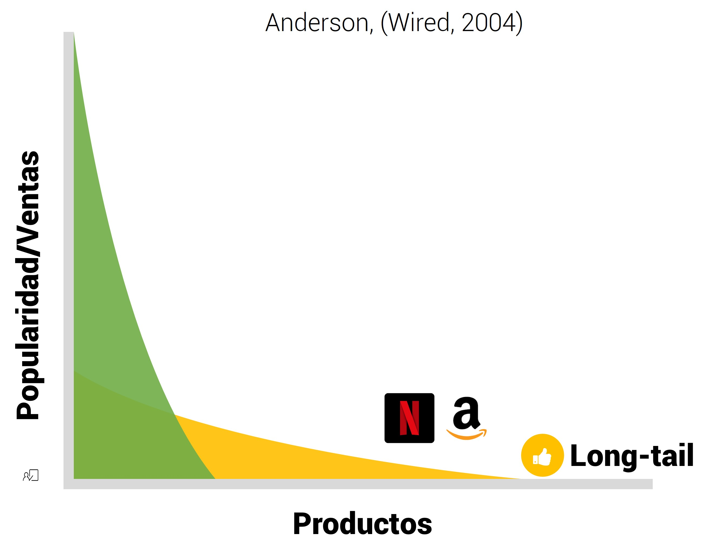

class: center, middle, remark-inverse

# 2. Características

---

# Características distintivas

.center[
```{r echo=FALSE, message=FALSE, warning=FALSE, out.width="95%"}


```
]

---

.pull-left[


```{r echo=FALSE, message=FALSE, warning=FALSE, out.width="45%"}


```

> Internet/Web disponibles en todas partes: trabajo, casa..., y en cualquier momento del tiempo

]


.pull-right[ 

- Mercado **desvinculado** de ubicación geográfica y temporal

- Costes de transacción: Mejora comodidad del cliente y reduce costes comerciales

- Separabilidad  de producción y consumo de servicios de distribución]

---
# Ubicación (II). Servicios de distribución
     
.left-column[

```{r echo=FALSE, message=FALSE, warning=FALSE, out.width="80%"}


```


]


.right-column[ 

- ### Localización

- ### Surtido (profundidad y amplitud)

- ### Fiabilidad entrega tiempo y forma

- ### Información

- ### Ambiente

### Nuevos intermediarios especialistas en servicios (e.g. Paypal)


]

---

.pull-left[


```{r echo=FALSE, message=FALSE, warning=FALSE, out.width="55%"}


```

>  La tecnología traspasa las fronteras nacionales, mercado global
]


.pull-right[ 

### <span style="font-size:0.7em">Marketspace incluye, potencialmente, miles de millones de consumidores y millones de empresas potenciales a nivel mundial</span> 
### <span style="font-size:0.7em">Marketspace también incluye, potencialmente,  miles de nuevos competidores a nivel mundial</span>
### <span style="font-size:0.7em">Nuevas oportunidades de negocio</span>
]

---
# 2. Alcance (II): Teoría del "long tail"

.center[
```{r echo=FALSE, message=FALSE, warning=FALSE, out.width="65%"}


```
]


<small style="font-size:0.7em"><a  href="https://www.youtube.com/watch?v=RIq3b9wPIcY" target="_blank">Cris Anderson explica la teoría</a></small><br>

---

.pull-left[


```{r echo=FALSE, message=FALSE, warning=FALSE, out.width="45%"}


```

>  Conjunto de <a href="https://es.wikipedia.org/wiki/Est%C3%A1ndares_web" target="_blank">estándares</a> de tecnología compartidos a nivel global: <a href="http://www.w3c.es/">Consorcio World Wide Web (W3C)</a>

]


.pull-right[ 

### - SI dispares, pueden comunicarse fácilmente entre sí

### - Costes de entrada en el Mercado bajos

### - Menores costes de búsqueda para los consumidores
]
---

.left-column[

```{r echo=FALSE, message=FALSE, warning=FALSE, out.width="95%"}


```

-  Texto, audio, video, imágenes... ¿tacto y olor?


```{r echo=FALSE, message=FALSE, warning=FALSE, out.width="45%"}


```


]


.right-column[ 

### <span style="font-size:0.7em">- Posibilidad de entregar mensajes más <span class="rojito">completos y complejos</span> a un gran número de personas</li></span>
### <span style="font-size:0.7em">- Video, audio, y mensajes de texto, se pueden integrar en un solo mensaje de marketing y en base a la experiencia del consumidor: <span class="rojito">publicidad online</span>

Ejemplo: juegos publicitarios y publicidad in-game, *wearables*

</img></img>

]

---

.pull-left[

</img>
<blockquote style="font-size:0.8em"> <i style="color:rgba(238, 0, 0, 0.9)" class="fa fa-quote-left"></i> La tecnología funciona mediante la interacción con el usuario</blockquote>


]

.pull-right[

### <span style="font-size:0.7em">- Consumidores más involucrados en un <span class="rojito">diálogo</span> </span>
### <span style="font-size:0.7em">-El consumidor es <span class="rojito">coparticipante</span> en el proceso de entrega de productos: <span class="rojito">"Mass-Customization"</span></span>


<a href="http://www.nike.com/es/es_es/c/nikeid" target="_blank">NikeiD</a>/
<a href="https://www.mymms.es/" target="_blank">M&amp;Ms</a>

- Publicidad personalizada que crea "engagement":


<iframe width="260" height="150" src="https://www.youtube.com/embed/bGFflwe4mtI" frameborder="0" allow="autoplay; encrypted-media" allowfullscreen></iframe>

<a href="https://www.youtube.com/watch?time_continue=1&v=bGFflwe4mtI" target="_blank"><span style="font-size:0.6em">Caso Kleenex</a>

]

---
.left-column[


<blockquote style="font-size:0.7em"> Cantidad y calidad de información total </blockquote>

<blockquote style="font-size:0.7em"> Acceso a tiempo</blockquote>

</img>]

.right-column[

### <span style="font-size:0.7em">- Se reduce la asimetría en información entre oferentes y clientes</span>

### <span style="font-size:0.7em">- Para los clientes esto supone:</span>

<span style="font-size:0.7em">- Mayor información sobre los <span class="invp">precios</span>: e.g. <a href="http://www.rastreator.com/" target="_blank">Rastreator</a></span><br>
<span style="font-size:0.7em">- Mayor información sobre los <span class="invp">costes</span>: e.g. <a href="https://news.ihsmarkit.com/press-release/technology/iphone-x-costs-apple-370-materials-ihs-markit-teardown-reveals" target="_blank">¿Cuánto cuesta producir un móvil?</a></span>

### <span style="font-size:0.7em">- Para los oferentes esto supone mayor información sobre los clientes: Establecer prácticas de <span class="invp">segmentación de precios</span> e.g. <a target="_blank" href="https://www.telegraph.co.uk/travel/news/Never-book-flights-on-Fridays-and-eight-other-tips-for-getting-cheap-air-fares/">Ejemplos discriminación precios</a></span>

### <span style="font-size:0.7em">- Medios, interacción y densidad de información: Daños potenciales a la privacidad</span>
]


---

.left-column[


<blockquote style="font-size:0.8em">Interactividad + Densidad de información: Personalización máxima</blockquote>

]

.right-column[

### <span style="font-size:0.7em">- Acciones de <span class="rojito">CRM</span> adaptadas a su comportamiento anterior</span>
### <span style="font-size:0.7em">- Importancia de soluciones de <span class="rojito">"Identity Resolution"</span></span>

- Necesidad de valorar hasta dónde llegar en la personalización

.center[<a href="images/creepy.png" target="_blank"></a>
]

]

---

.pull-left[

<blockquote style="font-size:0.7em"> Promueve la generación de contenidos de usuarios y redes sociales</blockquote>

]

.pull-right[

### <span style="font-size:0.7em">- Usuarios como prescriptores de productos</span>
### <span style="font-size:0.7em">- Necesidad de gestión del e-WOM</span>

<a href="images/renfe.png" target="_blank"></a>
]

