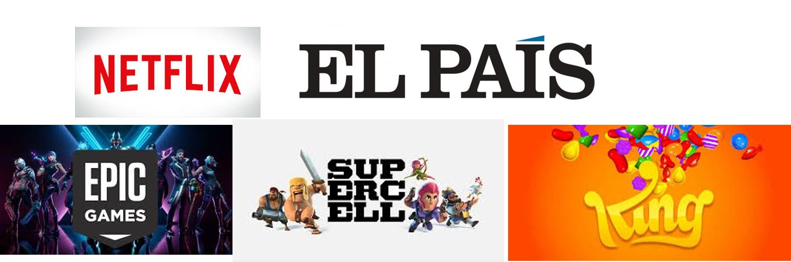
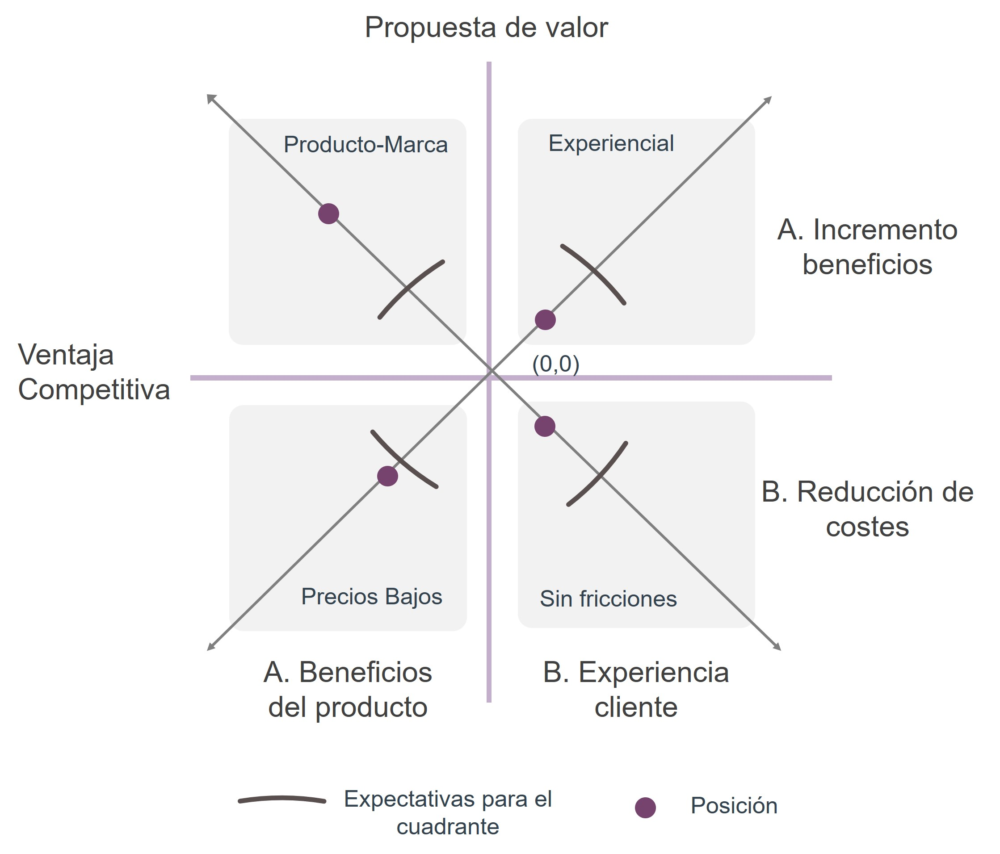

class: center, middle, remark-inverse

# 3. Modelos de Negocio en Comercio Electrónico


---


## Principales tipos de comercio electrónico </h3>

<table class="tablabase">

<tr ><td style="color:rgba(53,60,83,.9)">B2C</td><td style="background-color:rgba(53,60,83,.9); color:rgba(220, 220, 220, 0.9)">B2B</td></tr>
 <tr><td  style="background-color:rgba(53,60,83,.9); color:rgba(220, 220, 220, 0.9)">C2C</td><td style="color:rgba(53,60,83,.9)">C2B</td></tr>

</table>

### <span style="font-size:0.8em"> - B2B: Empresa a Empresa: plataformas y redes privadas</span>
###<span style="font-size:0.8em"> -  B2C: Empresa a Consumidor: con canal propio o a través de intermediarios (minoristas o plataformas)</span>
### <span style="font-size:0.8em">-  C2C: Consumidor a Consumidor: plataformas de venta y servicios bajo demanda</span>
### <span style="font-size:0.8em"> - C2B: De consumidor a empresa: por desarrollar (ejemplos: <a href="https://www.ocu.org/especiales/quieropagarmenosluz/cerrado" target="_blank">OCU energía</a>, <a href="https://www.ocu.org/especiales/quieropagarmenosgasolina/cerrado" target="_blank">OCU Gasolina</a>, <a href="http://www.asociacion-anae.org/ahorra" target="_blank">ANAE Energía</a>, <a href="https://www.unnea.net/#/">unnea</a>)</span>


---
class:center

## Importancia de los distintos tipos de comercio electrónico
--


---
class:center
# <span style="font-size:0.8em"> Tipos de modelos de negocio <br>¿qué es un modelo de negocio?</span>


---

# <span style="font-size:0.8em"> Modelos de negocio B2B</span>

## 1. En internet

### 1.1. e-distribuidor

### 1.2. e-facilitadores

### 1.3. Plataformas de intercambio

### 1.4. Consorcios industriales

## 2. Redes privadas
---

.left-column[

# <span style="font-size:0.7em"> Modelos de negocio</span>

## <span style="font-size:0.7em"> e-distribuidores</span>
]

.right-column[
- Empresas que suministran productos directamente a otras empresas a través de internet
- Modelo mayorista tradicional trasladado al entorno online
- Modelo de ingresos: venta de bienes
- e.g. <a href="https://www.grainger.com/" target="blank">https://www.grainger.com/</a>

]

---


.left-column[

# <span style="font-size:0.7em"> Modelos de negocio</span>

## <span style="font-size:0.7em"> e-facilitadores</span>
]

.right-column[
- Empresas que crean y distribuyen acceso a los mercados digitales
- e.g. Ariba-SAP: software para creación de plataformas, catálogos... 
- Modelo de ingresos: venta de servicios
- e.g. <a href="https://www.ariba.com/es" target="blank">https://www.ariba.com/es</a>

<iframe width="280" height="180" src="https://www.youtube.com/embed/4x2BS5D03lg" frameborder="0" allow="autoplay; encrypted-media" allowfullscreen></iframe>

<a href="https://www.youtube.com/watch?v=4x2BS5D03lg" target="_blank"><span style="font-size:0.6em">Ariba</a></a>
]

---

.left-column[

# <span style="font-size:0.7em"> Modelos de negocio</span>

## <span style="font-size:0.7em"> Mercados de intercambio</span>

]

.right-column[

- Mercado independiente digital con muchos proveedores para grandes compradores
- Modelo de ingresos: comisión sobre intercambios
- Normalmente centrados en una industria en concreto (acero, polímeros, alumnio)
- Contratos a corto plazo de inputs directos
- e.g. <a href="http://www.powersourceonline.com/" target="blank">http://www.powersourceonline.com/</a> <a href="https://www.ilsmart.com/" target="_blank">https://www.ilsmart.com/</a>


]

---


.left-column[

# <span style="font-size:0.7em"> Modelos de negocio</span>

## <span style="font-size:0.7em"> Consorcios Industriales</span>
]

.right-column[

- Mercados digitales creados por una industria
- Verticales: proveedores para una industria (automóvil, aeroespacial, química) u horizontales: un producto a una variedad de empresas. 
- Modelo de ingresos: comisión sobre intercambios
- Más exitosos que los operados por empresas independientes
- e.g. <a href="https://www.supplyon.com/es/" target="blank">https://www.supplyon.com/es/</a> fundada por Bosch
]

---


.left-column[

# <span style="font-size:0.7em"> Modelos de negocio</span>

## <span style="font-size:0.7em"> 2. Plataformas</span>

]

.right-column[

## Redes privadas industriales

- Plataforma creada para gestionar el flujo de comunicación entre empresas que trabajan juntas
- Normalmente propiedad de un gran cliente
- Participantes: proveedores a largo plazo
- e.g. <a href="https://rllogin.wal-mart.com/rl_security/rl_logon.aspx?ServerType=IIS1&CTAuthMode=BASIC&language=en&CT_ORIG_URL=%2F&ct_orig_uri=%2F" target="blank">https://rllogin.wal-mart.com</a> Walmart
]

---


# <span style="font-size:0.8em"> Modelos de negocio B2C</span>

.center[


]
---

.left-column[

# <span style="font-size:0.7em"> B2C</span>

## <span style="font-size:0.7em"> e-Minoristas</span>

]

.right-column[

## 1. e-Minoristas
<blockquote style="font-size:0.8em"> <i style="color:rgba(238, 0, 0, 0.9)" class="fa fa-quote-left"></i> Venta de productos físicos o servicios tradicionales</blockquote>

<a href="images/etailer1.jpg" target="_blank"></a> 
<a href="http://iabspain.es/" target="_blank" style="font-size:0.3em">Fuente: IAB</a>
]

      
---
.left-column[

# <span style="font-size:0.7em"> B2C</span>

## <span style="font-size:0.7em"> e-Minoristas</span>

]

.right-column[

## Tipos de minoristas online

<table class="tablabase">
<tr>
<td>
- Minoristas virtuales ("pure players")
</td>

<td>
</img>
</td>
</tr>
<tr>
<td>
- Bricks and Clicks
</td>
<td>
</img>
</td>
</tr>

<tr>
<td>
- Minoristas de catálogo
</td>
<td>
</img>
</td>
</tr>


<tr>
<td>
- Canales directos
</td>
<td>
</img>
</td>
</tr>
</table>

]
---

.left-column[

# <span style="font-size:0.7em"> B2C</span>

## <span style="font-size:0.7em"> Agentes de Transacciones</span>

]

.right-column[

## <span style="font-size:0.7em">  2. Agentes de Transacciones</span>

### <span style="font-size:0.7em">  Intermediarios que facilitan las transacciones</span>

### <span style="font-size:0.7em">  Paypal, Tripadvisor, Rastreator...</span>


- Modelo de ingresos: comisionistas


]

      
---

.left-column[

# <span style="font-size:0.7em"> B2C</span>

## <span style="font-size:0.7em"> Creadores de mercado</span>

]

.right-column[

## 3. Creadores de mercado
## <span style="font-size:0.7em">- Facilitan la infraestructura de compra a cambio de una comisión</span>

- Modelo de ingresos: comisionistas


<a style="font-size:0.6em" href="http://marketing4ecommerce.net/amazon-mecanica-de-un-marketplace/" target="_blank">Cómo funciona Amazon Marketplace</a>
]

---


.left-column[

# <span style="font-size:0.7em"> B2C</span>

## <span style="font-size:0.7em"> Proveedores de contenido</span>


]

.right-column[

## 4. Proveedores de contenido
## <span style="font-size:0.7em">- Generan ingresos al proveer contenido digital</span>

- Modelo de ingresos: publicidad, suscripción, micropagos, freemium



<p></p>


[Epic games: 1.800 millones $ en 2019](https://www.emprendedores.es/casos-de-exito/a30452926/esta-es-la-asombrosa-facturacion-de-fortnite-en-2019/), [Supercell: 1400 millones](https://www.xatakamovil.com/mercado/clash-royale-lidero-ingresos-supercell-que-firmo-1-400-millones-dolares-2018), [King: 1.500 millones de dolares](https://www.xatakamovil.com/aplicaciones/siete-anos-candy-crush-caramelos-digitales-valiosos-historia)

]
---


.left-column[

# <span style="font-size:0.7em"> B2C</span>

## <span style="font-size:0.6em"> Proveedores de comunidad</span>


]

.right-column[

## 5. Proveedores de comunidad
## <span style="font-size:0.6em">- Crean el espacio alrededor del cual se crean las comunidades</span>

- Modelo de ingresos: principalmente publicidad
- Ley de Metcalfe

<a href="images/comunidad2.jpg" target="_blank"></a> <br>
<a style="font-size:0.6em" href="http://www.businessinsider.com/twitter-vs-facebook-snapchat-user-growth-chart-2017-2?utm_source=feedly&utm_medium=referral" target="_blank">Fuente: Business Insider</a>
]
                            

---


.left-column[

# <span style="font-size:0.7em"> B2C</span>

## <span style="font-size:0.6em"> Portales<br>


]

.right-column[

## 6. Portales
## <span style="font-size:0.6em">- Provee un punto inicial de entrada a Internet con servicios adicionales</span>

- Modelo de ingresos: publicidad 

<br>

<br> <a href="http://gs.statcounter.com/search-engine-market-share" target="_blank"><span style="font-size:0.5em">Fuente: StatCounter</span></a>

]
                            

---


.left-column[

# <span style="font-size:0.7em"> B2C</span>

## <span style="font-size:0.5em"> Proveedor de servicios<br>


]

.right-column[

## 7. Proveedor de servicios
## <span style="font-size:0.6em">- Proporcionan servicios digitales y aplicaciones Web 2.0: SaaS</span>

- Modelo de ingresos: suscripción


]

---

# Análisis de las estrategias en mercados digitales: Innovaciones disruptivas: 

### - Gran velocidad de cambio, nuevos modelos comerciales de éxito en el mundo digital

### - Análisis de modelos: La matriz de éxito de Kahn (2018)

### Dos dimensiones

 - Posicionamiento en la oferta: Desempeño de producto y desempeño experiencial
 - Ventaja competitiva: Liderazgo en costes o aumento en margen


---
class:center

.center[

```{r, cache=TRUE, echo=FALSE, out.width="95%"}


```
  
]  


---

class:center

# <span style="font-size:0.7em">Dibujando una posición competitiva</span>

.center[

```{r, cache=TRUE, echo=FALSE, out.width="75%"}


```
  
]  


---


# <span style="font-size:0.7em">Estrategias</span>

.pull-left[

- Supervivencia: valor razonable en todos los canales
- Líder de mercado: valor superior a los demás al menos en uno y razonablemente bueno en todos
- Mercados cada vez más competitivos: top en dos cuadrantes sin ignorar los otros dos

]

.pull-right[

```{r, cache=TRUE, echo=FALSE, out.width="95%"}


```
  
]  

---
# <span style="font-size:0.7em">El caso Amazon</span>


```{r, cache=TRUE, echo=FALSE, out.width="95%"}


```
