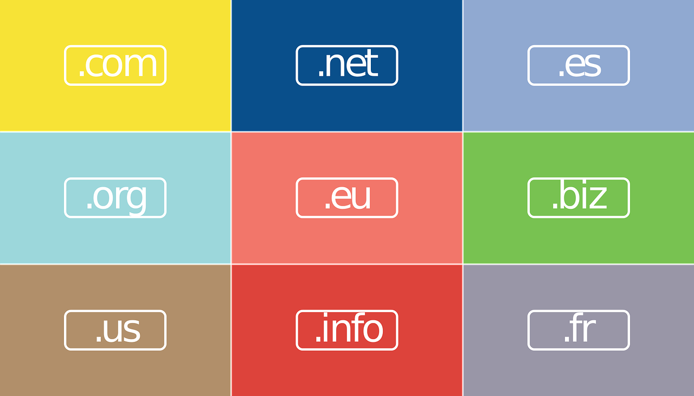
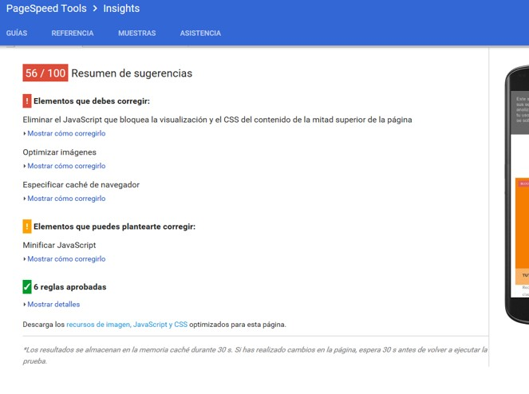

class: center, middle, remark-inverse

# 4. Gestión del Sitio Web

---
# Decisiones del sitio

### - Objetivos del sitio: ¿para qué?
### - Creación y gestión interna o externa
### - Dominio, hosting y software: "Content Management System" 
### - Estrategia posicionamiento

---
# Objetivos del sitio: ¿para qué?</h3>
                    
<table class="tablabase" style = "font-size:0.65em">
<thead><th>Objetivo de negocio</th><th>Funcionalidad Sistema</th><th>Requerimiento Información</th></thead>
<tr><td>Mostrar productos</td><td>Catálogo digital</td><td>Catálogo de texto dinámico y gráficos</td></tr>
<tr><td>Información sobre productos</td><td>Base de datos de productos</td><td>Descripción de productos, cifras de existencias, inventarios, </td></tr>
<tr><td>Mostrar contenido adaptado</td><td>Rastreo de clientes en sitio</td><td>Registro del sitio en cada visita de cliente, capacidad para identificar tipo de cliente y emitir respuesta</td></tr>
<tr><td>Hacer compras</td><td>Carrito de compras/sistema de pago</td><td>Aprobación segura de tarjetas de crédito</td></tr>
<tr><td>Recoger datos de clientes</td><td>Base de datos de clientes</td><td>Formulario de registro para clientes en linea, campos predefinidos</td></tr>
<tr><td>Soporte al cliente</td><td>Base de datos de ventas y CRM</td><td>ID cliente, producto, fecha, pago, fecha envío</td></tr>
<tr><td>Análisis del cliente</td><td>Sistema de rastreo e informes</td><td>Número de visitantes únicos, páginas visitadas, productos comprados, rutas</td></tr>
<tr><td>Soporte a proveedores</td><td>Sistema de administración de inventarios</td><td>Niveles de producto e inventario, ID de proveedor y contacto, ordenar datos por cantidad de producto</td></tr>
</table>

---
# Creación del sitio

<table class="tablabase">
<thead><th></th><th></th><th colspan="2">Creación del sitio</th></thead>
<thead><th></th><th></th><th>Propio</th><th>Externo</th></thead>
<tr><th rowspan="2">Alojamiento</th><th>Propio</th><td  style="background-color:rgba(53,60,83,.9); color:rgba(220, 220, 220, 0.9)" >Totalmente en casa</td><td style="color:rgba(53,60,83,.9)">Responsabilidad Mixta</td></tr>
<tr><th>Externo</th><td   style="color:rgba(53,60,83,.9)">Responsabilidad Mixta</td><td  style="background-color:rgba(53,60,83,.9); color:rgba(220, 220, 220, 0.9)">Totalmente subcontratado</td></tr>
</table>

---
# Decisiones adicionales

### - Dominio          
### - Hosting
### - Content Management Systems

---
# Dominios

.pull-left[

```{r echo=FALSE, message=FALSE, warning=FALSE, out.width="95%"}


```


]
.pull-right[

### - <a href="http://www.dominios.es/dominios/" target="_blank">Página Oficial</a>
### - Normalmente se contratan a través de un intermediario
### - <a href="http://www.dominios.es/dominios/es/todo-lo-que-necesitas-saber/sobre-registros-de-dominios/cuanto-cuesta" target="_blank">Precios</a>
]


---

# Soluciones todo en uno 

### - <a href="https://sites.google.com/?hl=es" target="_blank">Google Sites</a>
### - <a href="http://www.weebly.com/home/" target="_blank">Weebly</a>
### - <a href="http://es.wix.com/">Wix</a>
### - <a href="http://es.jimdo.com/" target="_blank">Jimdo</a>
### - <a href="http://www.1and1.es/" target="_blank">1&amp;1</a>

---
# CMS:  Software específico

### - <a href="http://www.adobe.com/es/products/dreamweaver.html" target="_blank">Adobe Dreamweaver</a>
### - <a href="https://www.microsoftstore.com/store/mseea/es_ES/list/Visual-Studio/categoryID.66235600?gclid=CMjw-5jotNICFdKDGwodg8oHiw&gclsrc=ds&tduid=%280596cc0b5ea4b1f68f717a8f00e13306%29%28190947%29%281020326%29%28jkp_CMjw-5jotNICFdKDGwodg8oHiw%29%28%29" target="_blank">Visual Studio</a>
###- <a href="https://wordpress.org/" target="_blank">Wordpress.org</a>
###- <a href="https://www.joomla.org/" target="_blank">Joomla</a></li>
###- <a href="https://www.drupal.org/" target="_blank">Drupal</a></li>
###- <a href="http://www.infoglue.org/" target="_blank">Infoglue</a></li>
###- <a href="https://w3techs.com/" target="_blank">Estadísticas de CMS: Wordpress es el líder</a>

---
# Hosting

### - Hosting propio
### - Hosting compartido en un servidor
### - Alojamiento web VPS: servidor virtual privado
### - Alojamiento web dedicado

- <a href="http://www.hostgator.com/" target="_blank">Ejemplo precios</a>
---
# Decisiones sobre mantenimiento: técnico y contenido</h3>

### - Propio: Necesidad de personal técnico y de contenidos
### - Externo: Falta de control  

---

# Posicionamiento web

.pull-left[

## Posicionamiento web: SEO Y SEM

```{r echo=FALSE, message=FALSE, warning=FALSE, out.width="95%"}

knitr::include_graphics("images/seo.jpg")
```


]

.pull-right[

> SEO: Search Engine Optimization- Orgánico en buscadores


> SEM: Search Engine Marketing- Inserciones pagadas, ya mencionado

]

---
# Posicionamiento web-SEO: Robots (i)</h3>

.pull-left[

]
.pull-right[

### 1. Encuentran
### 2. Descargan
### 3. Almacenan
### 4. Detectan y analizan
### 5. Recuperan

]
---
# 1. Encuentran

### - Los robots encuentran las páginas siguiendo <b>enlaces</b></p>
### - Para ello:

<table>
   <tr><td style="width:50%"><span  style="color:rgba(238, 0, 0, 0.9)">a)</span> Las páginas deben estar enlazadas en algún sitio</td><td><span  style="color:rgba(238, 0, 0, 0.9)">b)</span> Los enlaces deben ser rastreables</td></tr>
</table>           

---
# Enlaces

### - Alta en <a href="https://www.google.com/webmasters/tools/home?hl=es" target="_blank">Google Search Console</a>
### - SEO *OffPage*: directorios públicos, redes sociales, comentarios...

### - Desde páginas relevantes. Calidad mejor que cantidad

### - RSS: blogs, comentarios, redes sociales, foros, sitios de respuestas, guías y directorios 
### - ¡Ojo con el crecimiento desmesurado!
---
# Enlaces (2)

### - Los enlaces deben ser rastreables

<pre><code data-trim><a href="dirección destino">Texto ancla (anchor text)</a></code></pre>


### - Texto ancla: Ilustrativo, relacionado con contenido<br>  
<i style="color:rgba(238, 0, 0, 0.9" class="fa fa-ban" ></i><span  style="color:rgba(238, 0, 0, 0.9)"> más info</span></p>

---
### Ejemplo: Anchoring correcto

<a href="http://internacional.elpais.com/internacional/2017/03/01/estados_unidos/1488340300_414826.html" target="_blank"></a>

---

# SEO_Robots: 2. <span  style="color:rgba(238, 0, 0, 0.9)">DESCARGAN</span>


### - La velocidad de descarga es uno de los factores del ranking
### - Evitar <b>Imágenes pesadas, plantillas no optimizadas
### - <a href="https://www.google.es/intl/es/analytics/" target="_blank">e.g. Google Analytics</a>, <a href="https://www.google.com/intl/es/webmasters/#?modal_active=none" target="_blank">Herramientas Google para webmasters</a>           

---
# Ejemplo: google webmaster



---
# SEO_Robots: 3. <span  style="color:rgba(238, 0, 0, 0.9)">ALMACENAN</span>
                             
### - Copia en caché de las páginas: <a href="https://web.archive.org/web/*/www.unavarra.es" target="_blank">Página que permite acceder a versiones antiguas</a>

### - Para buscar: "cache:direcciondelsitio"

### - Herramientas en Search Console para eliminarlas

---
# SEO_Robots: 4. <span  style="color:rgba(238, 0, 0, 0.9)">DETECTAN Y ANALIZAN</span>

.pull-left[
```<h1> <h2> <h3> ```

``` ```

```<a> <iframe>...```

]       

.pull-right[

### - Contenido de la página y <b>señales</b> de su importancia:

### - Otras señales: "responsive", geolocalización, idioma…

]
---
# Contenido de la página

> Cuanto más relacionada está una página con la palabra o frase que alguien esté buscando, más arriba aparecerá en los resultados

### - Con qué palabras pueden buscarnos?: Hacer lista

### - <a href="https://ads.google.com/">Google Adworks</a>, <a href="https://kwfinder.com/" target="_blank">Keyword Finder</a>

---

# Contenido de la página (ii)

### - ¿Donde ponemos las palabras clave?: Estructura y naturalidad:

### - La prioridad en los títulos: Páginas, contenidos, categorías: <b>Etiquetas h</b>
### - Textos, enlaces
### - Imágenes y Vídeos, descripción:


```

</code>

<video id="Video1" source src="dirección" type="video/mp4" />
Este es un video ...</video>

```
---
# SEO_Robots: 5. <span  style="color:rgba(238, 0, 0, 0.9)">RECUPERAN</span></h3>
                              
### - Cuando alguien hace una búsqueda, ordenados en función de:

- <b>Pagerank</b>: ranking de popularidad (e.g. wikipedia vs navarrablog)
- <b>Trustrank</b>: ranking de autoridad (e.g. navarra.es vs navarrablog)
- Usuarios y su comportamiento (<b>Búsquedas personalizadas)</b>: lo que ese usuario ha visto, dónde está
- Evaluadores humanos y <b>penalizaciones</b> (Acciones Manuales en Tráfico de Búsqueda en Webmaster tools)
- Resultados por actualidad: <b>tiempo real</b>


                   
